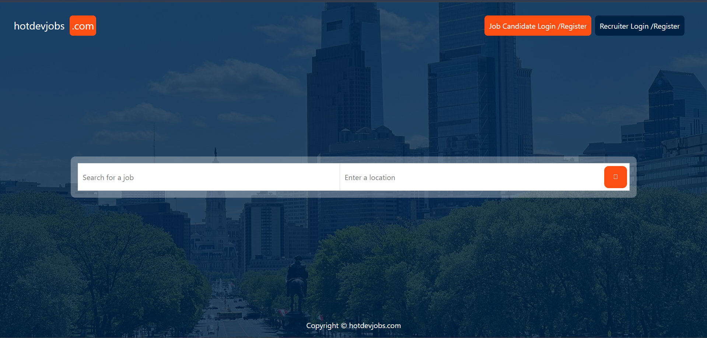
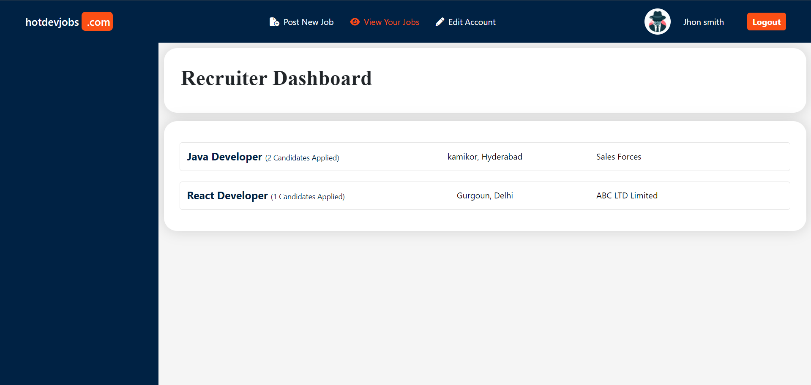
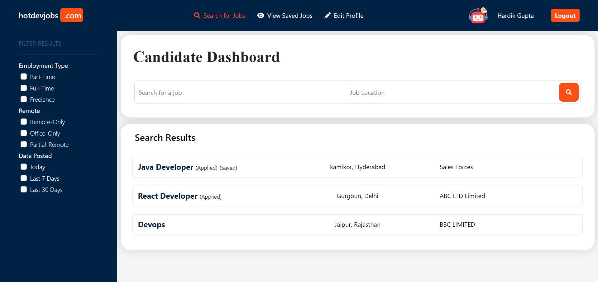
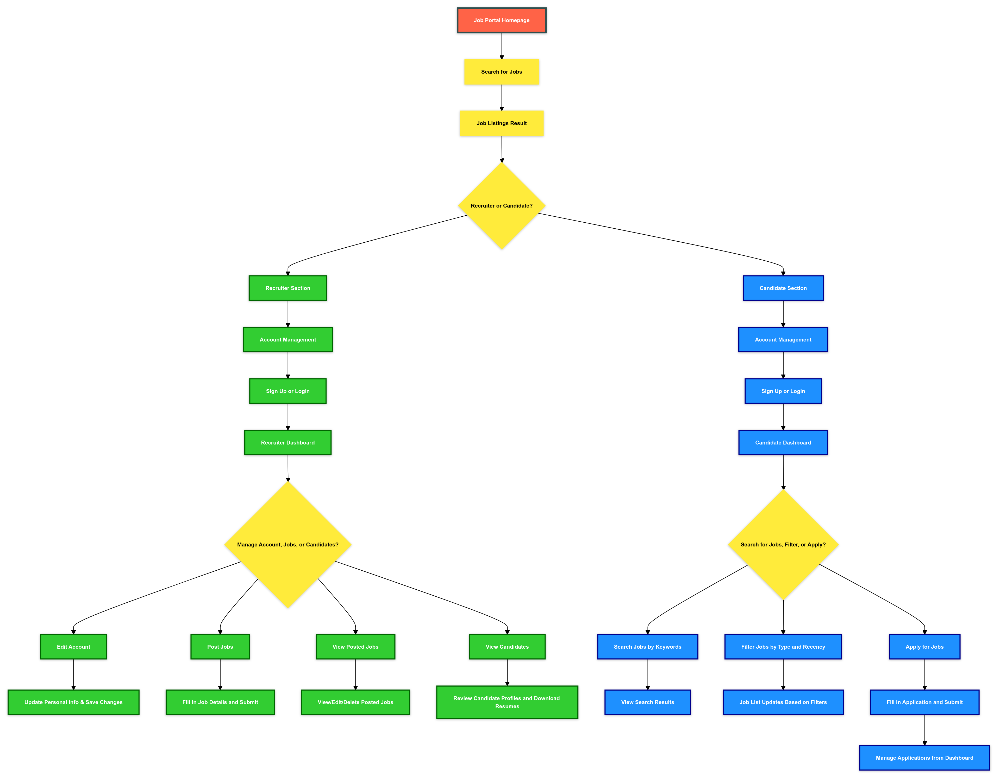
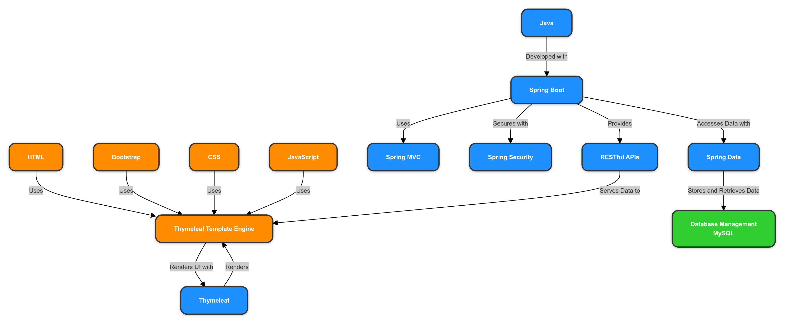

# Job Portal Web Application

### Project Overview

This project is an end-to-end job portal web application developed using Spring Boot, Spring MVC, and Thymeleaf. The platform streamlines the hiring process by providing a comprehensive solution where candidates can easily find job opportunities, and employers can efficiently discover top talent. The application offers robust features for both recruiters and candidates, enabling seamless job posting, job searching, and application management.

## Features

### Recruiter Section

- **Account Management**: Recruiters can sign up for a new account or log in to an existing account.
- **Dashboard**: After logging in or signing up, recruiters are redirected to their dashboard where they can:
  - **Edit Account**: Update personal details and account settings.
  - **Post Jobs**: Create and post job listings for their company.
  - **View Posted Jobs**: See a list of jobs they have posted.
  - **View Candidates**: Access profiles of candidates who have applied for their jobs and download their resumes.

### Candidate Section

- **Account Management**: Candidates can sign up for a new account or log in to an existing account.
- **Dashboard**: After logging in or signing up, candidates are redirected to their dashboard where they can:
  - **Search Jobs**: Search for job opportunities based on skills, location, and job type (e.g., part-time, full-time, remote).
  - **Filter Jobs**: Filter job postings by recency (e.g., last week, today).
  - **Apply for Jobs**: Apply for jobs and have their applications visible to recruiters.

## Technologies Used

- **Backend**: Java, Spring Boot, Spring MVC, Thymeleaf
- **Frontend**: HTML, Bootstrap, CSS, JavaScript (embedded in Thymeleaf)

## Application Views

### Job Search and Application

### Recruiter Dashboard

### Candidate Dashboard

## Contributions

- **CI/CD Pipeline Setup**: 
  - Established a continuous integration and continuous deployment (CI/CD) pipeline using Jenkins to automate the build, test, and deployment processes for the multi-tier web application.
  
- **Unit Testing & Code Analysis**: 
  - Implemented comprehensive unit testing using Maven. 
  - Integrated SonarQube for static code analysis to ensure code quality and maintainability.

- **Containerization & Deployment**: 
  - Containerized the application using Docker, creating a reliable and consistent deployment environment.
  - Pushed Docker images to Docker Hub, facilitating easy distribution and deployment.
  - Deployed the application on a Kubernetes cluster, ensuring scalability and high availability.

## Demo

You can preview the Job Portal live demo at [Job Portal Web Application](http://a762a7deda74e479faa9b92ad654467c-884693861.us-east-2.elb.amazonaws.com/). The demo provides a hands-on experience of the platform's features and functionality.

## Interaction Guide

1. **Job Portal Homepage**
   - Search for Jobs: Start by searching for available jobs using the search bar on the homepage.
   - Job Listings Result: After searching, you will be presented with job listings that match your search criteria.

2. **Recruiter Section**
   - **Account Management**
     - Sign Up: Create a new recruiter account with company details.
     - Login: Access your recruiter dashboard using your credentials.
   - **Recruiter Dashboard**
     - Edit Account: Update personal information.
     - Post Jobs: Create and post job listings.
     - View Posted Jobs: Manage existing job postings.
     - View Candidates: Review profiles and download resumes of applicants.

3. **Candidate Section**
   - **Account Management**
     - Sign Up: Register a new candidate account.
     - Login: Access your candidate dashboard using your credentials.
   - **Candidate Dashboard**
     - Search Jobs: Look for jobs by skills, location, or job type.
     - Filter Jobs: Narrow down results by job type and recency.
     - Apply for Jobs: Submit applications and track their status.

4. **Returning to Homepage**
   - Return to the Job Portal Homepage to continue exploring or to log out.
  
## Flowcharts

### User Interaction Flowchart

### Technology Stack Flowchart

## Contact Information

If you have any questions, suggestions, or just want to get in touch, you can reach us at:

- Email: [hg979084@gmail.com](mailto:hg979084@gmail.com)
- LinkedIn: [Hardik Gupta](https://www.linkedin.com/in/hardik-gupta830)

We appreciate your interest and look forward to your contributions and feedback!
